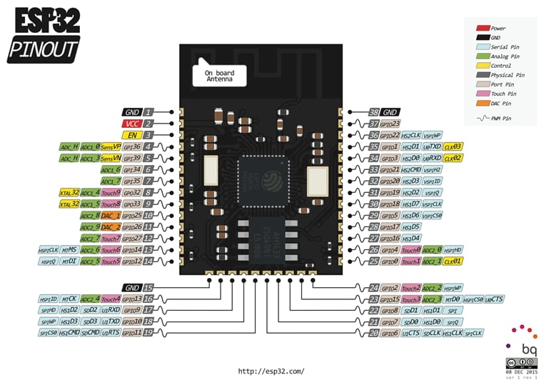

# ESP32

O ESP32 é um microcontrolador programável que tem como diferencial dos outros microcontroladores o Wi-Fi e o Bluetooth. Enquanto em alguns microcontroladores você precisa adicionar um módulo Wi-Fi ou Bluetooth e programá-lo para ter essa função, no ESP32 ele já vem com isso integrado.

Ele conta com um processador dual-core de até 240 MHz, 520 KB de RAM e 4 MB de memória flash — a memória flash é um tipo de memória não volátil que mantém o armazenamento mesmo sem uma fonte de energia. Por ser um microcontrolador muito popular, ele também conta com suporte a vários periféricos adicionais, como câmera, I2C, entre outros.

Na programação, são utilizadas as linguagens C ou C++ (embora seja possível usar muitas outras, essas são as mais comuns), e ele é compatível com a Arduino IDE. O ESP32 é famoso por entregar uma gama muito completa de recursos por um custo baixo.

---

## Pinos GPIO

O ESP32 possui **34 pinos GPIO**, sendo **22 digitais** e **12 analógicos**.

### O que são pinos digitais e analógicos?

Os **pinos digitais** operam apenas em dois níveis: alto (5V) e baixo (0V), ou seja, eles simplesmente ligam ou desligam.

Já os **pinos analógicos** foram feitos para ler níveis de sinais variados entre 0 e 5 volts. Nesses pinos é utilizada a técnica de **modulação por largura de pulso (PWM)**, que consiste em ciclos em que o sinal de voltagem fica ativo e desativado. Por exemplo, se eu quero que um LED acenda com 50% de brilho, o PWM vai mandar um sinal em que metade do tempo ele é alto e a outra metade é baixo.

---

## Mapeamento de Pinos

### Lado Esquerdo

| Pino Físico | GPIO | Função |
|:-----------:|------|--------|
| 1 | GND | Terra (referência elétrica do circuito). |
| 2 | VCC (3.3V) | Alimentação principal do módulo. |
| 3 | EN | Habilita ou reinicia o ESP32 quando acionado. |
| 4 | GPIO36 (SVP) | Entrada analógica ADC1_CH0. Apenas entrada digital. |
| 5 | GPIO39 (SVN) | Entrada analógica ADC1_CH3. Apenas entrada digital. |
| 6 | GPIO34 | ADC1_CH6. Apenas entrada digital. |
| 7 | GPIO35 | ADC1_CH7. Apenas entrada digital. |
| 8 | GPIO32 | ADC1_CH4, Touch9 e cristal de baixa frequência. Entrada e saída digital. |
| 9 | GPIO33 | ADC1_CH5, Touch8 e cristal de baixa frequência. Entrada e saída digital. |
| 10 | GPIO25 | ADC2_CH8 e DAC1. Entrada, saída e saída analógica. |
| 11 | GPIO26 | ADC2_CH9 e DAC2. Entrada, saída e saída analógica. |
| 12 | GPIO27 | ADC2_CH7 e Touch7. Entrada e saída digital. |
| 13 | GPIO14 | ADC2_CH6, Touch6 e sinal SPI MTMS. Entrada e saída digital. |
| 14 | GPIO12 | ADC2_CH5, Touch5 e sinal SPI MTDI. Entrada e saída digital. |

### Parte Inferior Esquerda

| Pino Físico | GPIO | Função |
|:-----------:|------|--------|
| 15 | GND | Terra (GND). |
| 16 | GPIO13 | ADC2_CH4, Touch4, HSPI_ID. Entrada e saída digital. |
| 17 | GPIO9 | Conectado à memória flash interna (SD2). Não recomendado para uso geral. |
| 18 | GPIO10 | Conectado à memória flash interna (SD3). Não recomendado para uso geral. |
| 19 | GPIO11 | Conectado à memória flash interna (CMD). Não recomendado para uso geral. |

### Lado Direito Inferior

| Pino Físico | GPIO | Função |
|:-----------:|------|--------|
| 20 | GPIO6 | Ligado à memória flash (CLK). Não utilizar em projetos. |
| 21 | GPIO7 | Ligado à memória flash (D0). Não utilizar em projetos. |
| 22 | GPIO8 | Ligado à memória flash (D1). Não utilizar em projetos. |
| 23 | GPIO15 | ADC2_CH3, Touch3, SPI CS e pino de boot. |
| 24 | GPIO2 | ADC2_CH2, Touch2 e pino de boot. |
| 25 | GPIO0 | ADC2_CH1, Touch1 e pino de boot/programação. |
| 26 | GPIO4 | ADC2_CH0, Touch0. Entrada e saída digital. |

### Lado Direito Superior

| Pino Físico | GPIO | Função |
|:-----------:|------|--------|
| 27 | GPIO16 | UART2 RX e comunicação serial. |
| 28 | GPIO17 | UART2 TX e comunicação serial. |
| 29 | GPIO5 | SPI CS. Entrada e saída digital. |
| 30 | GPIO18 | SPI Clock (SCK). Entrada e saída digital. |
| 31 | GPIO19 | SPI MISO. Entrada e saída digital. |
| 32 | GPIO21 | I²C SDA. Entrada e saída digital. |
| 33 | GPIO3 | UART0 RX (recepção serial usada na programação). |
| 34 | GPIO1 | UART0 TX (transmissão serial usada na programação). |
| 35 | GPIO22 | I²C SCL. Entrada e saída digital. |
| 36 | GPIO23 | SPI MOSI. Entrada e saída digital. |
| 37 | — | Reservado. |
| 38 | GND | Terra (GND). |

---

## Legenda das Cores do Diagrama

| Cor | Significado |
|-----|-------------|
| 🔴 Vermelho | Alimentação (Power) |
| ⚫ Preto | Terra (GND) |
| 🔵 Azul Claro | Comunicação Serial |
| 🟢 Verde | Entrada Analógica (ADC) |
| 🟡 Amarelo | Pinos de Controle/Boot |
| ⬜ Cinza | Numeração Física dos Pinos |
| 🟫 Bege | Numeração das Portas GPIO |
| 🩷 Rosa | Sensores Touch |
| 🟠 Laranja | Conversor Digital-Analógico (DAC) |
| `~` | Suporte a PWM |

---

## Observações Importantes

> ⚠️ **GPIO34, GPIO35, GPIO36 e GPIO39** funcionam apenas como entrada.

> ⚠️ **GPIO6 a GPIO11** são utilizados pela memória flash interna e **não devem ser usados** em projetos.

> ⚠️ **GPIO0, GPIO2, GPIO12 e GPIO15** influenciam o processo de boot do ESP32 e exigem atenção durante a inicialização.

> ℹ️ **GPIO25 e GPIO26** são os únicos pinos com saída analógica (DAC).

> ℹ️ **GPIO21 (SDA)** e **GPIO22 (SCL)** são os pinos padrão para comunicação I²C.

> ℹ️ **GPIO18, GPIO19, GPIO23 e GPIO5** são os pinos padrão para comunicação SPI.

> ℹ️ **GPIO1 e GPIO3** são usados pela porta serial USB para gravação e depuração.