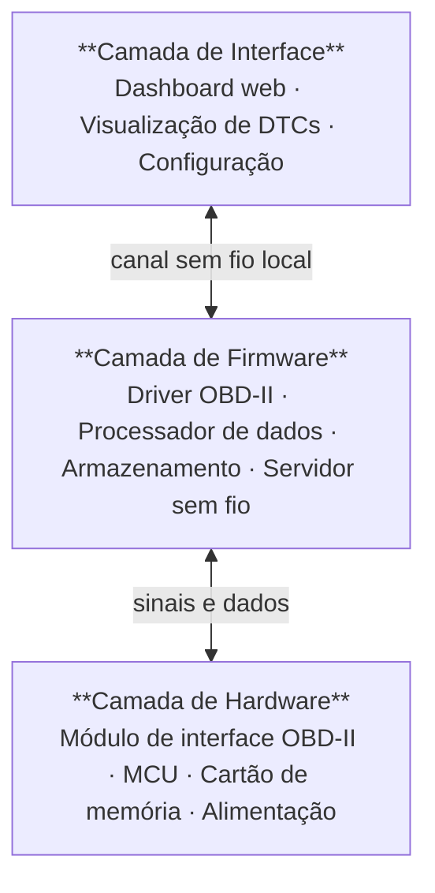
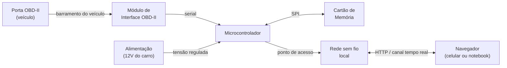

# Arquitetura do Sistema

&emsp;O OBD-II Reader é organizado em três camadas interdependentes: **hardware**, **firmware** e **interface**. Cada camada tem responsabilidade única e se comunica exclusivamente com a camada adjacente, garantindo isolamento e facilidade de evolução independente.

## Visão Geral

## Princípios de Design

&emsp;Dois princípios guiam as decisões arquiteturais do projeto:

**Isolamento por camadas.** O firmware não conhece detalhes de como a interface renderiza os dados; a interface não sabe como o firmware se comunica com o carro. Cada camada expõe apenas o necessário para a camada acima. Isso permite desenvolver e testar partes independentes ao mesmo tempo e facilita substituir componentes sem reescrever tudo.

**Acessibilidade sem infraestrutura.** O dispositivo precisa funcionar num estacionamento, numa garagem ou em pista, sem roteador e sem internet. Por isso, o próprio dispositivo cria a rede sem fio e serve a interface localmente. O usuário final não instala nenhum aplicativo: basta abrir o navegador.

## Camada de Hardware

&emsp;A camada de hardware é composta por quatro blocos que, juntos, formam o dispositivo físico.

### Módulo de interface OBD-II

&emsp;O módulo de interface OBD-II é o componente responsável por traduzir os protocolos elétricos do barramento do veículo (que variam de carro para carro) num protocolo serial simples e padronizado que o microcontrolador consegue ler. Ele se conecta fisicamente à porta de diagnóstico do carro e expõe os dados do motor via comandos de texto enviados pela interface serial.

&emsp;Esse módulo é o ponto de entrada de todos os dados do veículo no sistema. Sem ele, o microcontrolador não consegue se comunicar com a ECU do carro.

### Microcontrolador

&emsp;O microcontrolador é o processador central do dispositivo. Ele executa o firmware, processa os dados recebidos do módulo OBD-II, gerencia o cartão de memória e hospeda o servidor sem fio que serve o dashboard ao navegador do usuário. A escolha do microcontrolador será definida no decorrer do projeto, considerando requisitos de conectividade sem fio integrada, comunicação serial, leitura de cartão de memória e custo.

### Cartão de memória

&emsp;O módulo de cartão de memória permite gravar os dados lidos durante uma sessão de uso para análise posterior. Os dados são registrados com marcação de tempo, possibilitando correlacionar o comportamento do motor com diferentes condições de condução.

### Alimentação

&emsp;O circuito de alimentação converte a tensão da bateria do veículo (tipicamente 12 V) para o nível operacional do microcontrolador e dos demais componentes. Inclui proteções contra inversão de polaridade e transientes elétricos típicos do ambiente automotivo.

## Camada de Firmware

&emsp;O firmware é organizado em quatro módulos com responsabilidades distintas. Essa separação permite desenvolver e testar cada módulo de forma isolada, o que é especialmente útil nas etapas iniciais do projeto quando nem todo o hardware está disponível.

### Driver OBD-II

&emsp;O driver OBD-II é o módulo responsável por toda a comunicação com o módulo de interface. Ele envia comandos de consulta, interpreta as respostas e disponibiliza os dados em formato estruturado para o processador de dados. Cada grandeza do motor (rotação, temperatura, velocidade, etc.) é consultada por um identificador padronizado pelo protocolo OBD-II.

&emsp;O processo para implementar esse driver começa por aprender os comandos de inicialização e os identificadores de cada dado, testando a comunicação direto no terminal de um computador (via cabo USB) antes de integrar ao microcontrolador. Isso permite validar o comportamento do módulo sem precisar montar nenhum circuito.

### Processador de dados

&emsp;O processador de dados converte as respostas brutas do driver OBD-II em valores com unidades físicas (rotação em RPM, temperatura em graus Celsius, velocidade em km/h). Também interpreta os códigos de falha (DTCs) armazenados na ECU do veículo, traduzindo os códigos numéricos em descrições legíveis.

### Armazenamento

&emsp;O módulo de armazenamento é responsável por gravar os dados no cartão de memória em sessões contínuas. Cada registro inclui os valores de todas as grandezas lidas naquele instante e um timestamp sincronizado. O módulo também expõe os arquivos de log para download pela interface web.

### Servidor sem fio

&emsp;O servidor sem fio cria a rede local do dispositivo e atende as requisições da interface. Ele opera em segundo plano, de forma assíncrona, sem interferir nos outros módulos. Expõe dois canais para a interface: um canal de dados em tempo real para o dashboard e uma API para consulta de dados históricos, configuração e download de logs.

## Camada de Interface

&emsp;A interface é uma aplicação web servida diretamente pelo dispositivo. O usuário conecta o celular ou notebook à rede criada pelo dispositivo e acessa o dashboard pelo navegador, sem instalar nenhum aplicativo.

### Dashboard em tempo real

&emsp;O dashboard exibe as grandezas do motor com atualização contínua. Os valores são apresentados em gauges visuais (velocímetros, tacômetros, termômetros) que permitem ler os dados rapidamente enquanto o carro está em movimento ou parado com o motor ligado.

### Visualizador de DTCs

&emsp;A tela de códigos de falha lista todos os DTCs armazenados na ECU do veículo, com a descrição de cada código em português. Permite também apagar os códigos após a correção do problema.

### Configuração

&emsp;A tela de configuração permite ajustar parâmetros do dispositivo, como nome da rede sem fio, intervalo de leitura e quais grandezas monitorar. As configurações são salvas na memória permanente do microcontrolador.

## Diagrama de Blocos do Hardware

&emsp;O diagrama abaixo mostra como os componentes físicos se conectam:

## Ordem de Desenvolvimento

&emsp;A sequência abaixo representa a ordem lógica em que as partes do sistema devem ser construídas, das etapas que não exigem nenhum hardware até as que envolvem montagem e testes em veículo real:

<small><strong style={{fontSize: '12px'}}>Quadro 1: Ordem de desenvolvimento do projeto</strong></small>

| Etapa | O que fazer | Depende de | Resultado concreto |
|-------|------------|------------|-------------------|
| 1 | Configurar repositório e documentação | Nada | Repositório organizado, site de docs funcionando |
| 2 | Estudar o protocolo OBD-II e os identificadores de dados | Nada | Entendimento dos PIDs, protocolos e comandos AT |
| 3 | Conhecer o módulo de interface e seus comandos | Etapa 2 | Comunicação funcionando via cabo USB no computador |
| 4 | Conhecer os componentes eletrônicos do projeto | Nada | Entendimento do microcontrolador, módulo OBD-II e alimentação |
| 5 | Instalar e configurar o ambiente de programação | Etapa 4 | Firmware de teste rodando no microcontrolador |
| 6 | Aprender comunicação serial no microcontrolador | Etapa 5 | Microcontrolador enviando comandos e lendo respostas do módulo OBD-II |
| 7 | Implementar driver OBD-II no firmware | Etapa 6 | Grandezas do motor lidas e convertidas em unidades físicas |
| 8 | Implementar leitura contínua e leitura de DTCs | Etapa 7 | Todos os PIDs relevantes lidos em loop, DTCs listados |
| 9 | Aprender a criar servidor web e rede sem fio no microcontrolador | Etapa 5 | Página de teste acessível pelo navegador |
| 10 | Implementar canal de dados em tempo real | Etapas 8 e 9 | Dados do motor chegando ao navegador em tempo real |
| 11 | Implementar API REST para configuração e DTCs | Etapa 9 | Endpoints funcionando e testados |
| 12 | Construir dashboard web com gauges | Etapa 10 | Interface visual acessível pelo celular |
| 13 | Construir tela de DTCs e tela de configuração | Etapa 11 | Visualizador e limpeza de códigos de falha funcionando |
| 14 | Implementar log em cartão de memória | Etapa 7 | Dados gravados em arquivo durante a sessão |
| 15 | Implementar download do log pela interface | Etapas 13 e 14 | Arquivo baixável direto pelo navegador |
| 16 | Aprender a usar Tinkercad para simulação de circuitos | Etapa 4 | Circuito simulado e validado virtualmente |
| 17 | Desenhar esquemático completo no EasyEDA | Etapa 16 | Esquemático com todos os componentes e conexões |
| 18 | Montar protótipo em protoboard | Etapa 17 | Circuito físico validado com multímetro |
| 19 | Fabricar PCB | Etapa 18 | Placa de circuito impresso montada |
| 20 | Testes em bancada (sem carro) | Etapa 19 | Todos os módulos funcionando no hardware final |
| 21 | Testes em carro real e validação final | Etapa 20 | Dispositivo lendo dados reais de um veículo em operação |

<small style={{marginTop: '4px', fontSize: '10px'}}>Fonte: Material produzido pelo grupo, 2026.</small>

## Escopo da V1

&emsp;A primeira versão do OBD-II Reader cobre o conjunto mínimo necessário para ler e exibir dados de qualquer carro com porta OBD-II.

<small><strong style={{fontSize: '12px'}}>Quadro 2: Escopo da V1</strong></small>

| Incluído na V1 | Fora do escopo da V1 |
|----------------|----------------------|
| Leitura de grandezas em tempo real via OBD-II | Suporte a protocolos proprietários de montadoras |
| Exibição de DTCs com descrição em português | Banco de dados completo de todos os DTCs existentes |
| Limpeza de DTCs pela interface | Diagnóstico avançado por subsistema |
| Dashboard web acessível pelo navegador | Aplicativo nativo (mobile ou desktop) |
| Rede sem fio local criada pelo dispositivo | Conexão remota via internet |
| Log de dados em cartão de memória | Sincronização automática com nuvem |
| Download do log pela interface web | Análise automática de anomalias |
| Configuração de parâmetros pela interface | Atualizações de firmware remotas (OTA) |
| Compatibilidade Bluetooth com apps OBD-II | Suporte a veículos anteriores a 1996 |

<small style={{marginTop: '4px', fontSize: '10px'}}>Fonte: Material produzido pelo grupo, 2026.</small>

&emsp;As decisões técnicas que definem o escopo da V1, incluindo a escolha do microcontrolador e do módulo de interface OBD-II, serão documentadas conforme o projeto avança.

